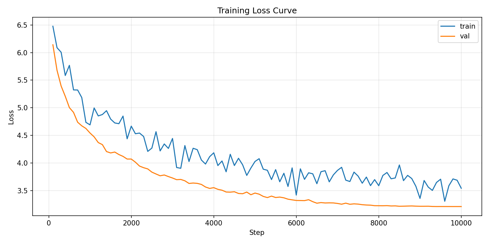

# Transformers from Scratch

GPT-2 implemented from scratch in PyTorch, trained on TinyShakespeare. No HuggingFace model weights — architecture, training loop, and tokenizer all written by hand.

## Architecture

- Decoder-only transformer (GPT-2 style)
- Causal self-attention with pre-LayerNorm
- RoPE positional encoding (configurable via `use_rope` flag)
- Character-level tokenization (vocab size: 65) for toy dataset: Shakespeare
- BPETokenizer and Tiktoken for WikiText

Default small config (~10M params):

| Param | Value |
|---|---|
| n_embed | 384 |
| n_heads | 6 |
| n_layers | 6 |
| max_seq_len | 256 |

## Training Results

Trained on TinyShakespeare (~1M chars, 80/10/10 split) with cosine LR decay and gradient clipping.

| Steps | Final Loss |
|---|---|
| 5000 | ~1.38 |

Random init baseline: `log(65) ≈ 4.17`. Char-level entropy lower bound: ~1.0.

## Usage

### TinyShakespeare (char-level, quick)

```bash
# Train
python train.py --dataset shakespeare --n_embed 384 --n_heads 6 --n_layers 6 \
  --max_seq_len 256 --steps 5000 --batch_size 32 --log_file training_log.csv

# Eval
python train.py --mode eval --dataset shakespeare --n_embed 384 --n_heads 6 --n_layers 6 \
  --max_seq_len 256

# Sample
python sample.py --checkpoint minigpt.pth --prompt "To be or not to be"
```

### WikiText-103 (BPE, GPT-2 small)

```bash
# Step 1: train tokenizer (optional — uses tiktoken by default)
python -m dataset.wikitext --vocab_size 5000 --out tokenizer.json

# Step 2: train model (uses tiktoken by default, pass --tokenizer for custom BPE)
python train.py --dataset wikitext --n_embed 768 --n_heads 12 --n_layers 12 \
  --max_seq_len 1024 --steps 10000 --batch_size 12 \
  --log_file training_log.csv --out_dir ./runs/gpt2s_wikitext

# Step 3: plot loss curve
python train.py --plot --log_file training_log.csv
```

## KV Cache Benchmark

Dynamic KV cache implemented in `gpt2/attention.py`. Benchmarked on small config (384 embed, 6 layers, prompt=32 tokens):

| New tokens | No cache (s) | KV cache (s) | Speedup |
|---|---|---|---|
| 32  | 0.210 | 0.077 | 2.71x |
| 64  | 0.460 | 0.151 | 3.05x |
| 128 | 1.170 | 0.318 | 3.68x |
| 256 | 3.845 | 0.805 | 4.78x |

Speedup grows with sequence length — consistent with the O(T²) → O(T) reduction in attention compute.

**Apple MPS (same config):**

| New tokens | No cache (s) | KV cache (s) | Speedup |
|---|---|---|---|
| 32  | 0.317 | 0.260 | 1.22x |
| 64  | 0.366 | 0.552 | 0.66x |
| 128 | 0.878 | 1.232 | 0.71x |
| 256 | 2.122 | 3.168 | 0.67x |

**Why MPS regresses:** MPS has high per-op dispatch overhead. The dynamic KV cache calls `torch.cat` every step, allocating a new growing tensor each time. On CPU/CUDA this overhead is negligible; on MPS it dominates and outweighs the compute savings. Production systems (vLLM, TGI, SGLang) use pre-allocated static buffers to avoid allocations in the hot loop entirely.

## TODO

- [x] RoPE positional encoding
- [x] BPE tokenizer

## Structure

```
gpt2/
  config.py      - ModelConfig, TrainerConfig dataclasses
  attention.py   - Causal multi-head self-attention
  block.py       - Transformer block (attention + MLP + LayerNorm + residual)
  gpt2.py        - Full GPT-2 model
train.py         - Training loop with cosine decay, char-level dataset
tokenizer/
  bpe.py         - BPE tokenizer
```

## GPT-2 Small Training Results

Trained from scratch on WikiText with the following config:
- 124M parameters (12 layers, 12 heads, 768 embed dim)
- BF16 mixed precision + Flash Attention
- 10,000 steps, batch size 12, seq length 1024
- AdamW with cosine LR schedule (3e-4 → 0)
- Trained on A10, ~72 minutes total

### Results
- Final validation loss: 3.21
- Validation perplexity: 24.8
- Reference: published GPT-2 small ~29 perplexity on WikiText-103

## Training Notes

Initial training attempts hit OOM at batch size 8 even with BF16 mixed precision. 
Investigation revealed that returning KV tensors from attention forward() during 
training was keeping ~13GB of activations alive unnecessarily (intended for 
inference KV cache). After fixing this and verifying Flash Attention was engaging,
trained successfully at batch 12 in ~72 minutes on a single A10 (22GB).

### Memory Optimizations Applied
- BF16 mixed precision (halves activation memory)
- F.scaled_dot_product_attention with is_causal=True (Flash Attention)
- Eliminated KV cache leak in training forward pass
- Cosine LR schedule

### Loss Curve
